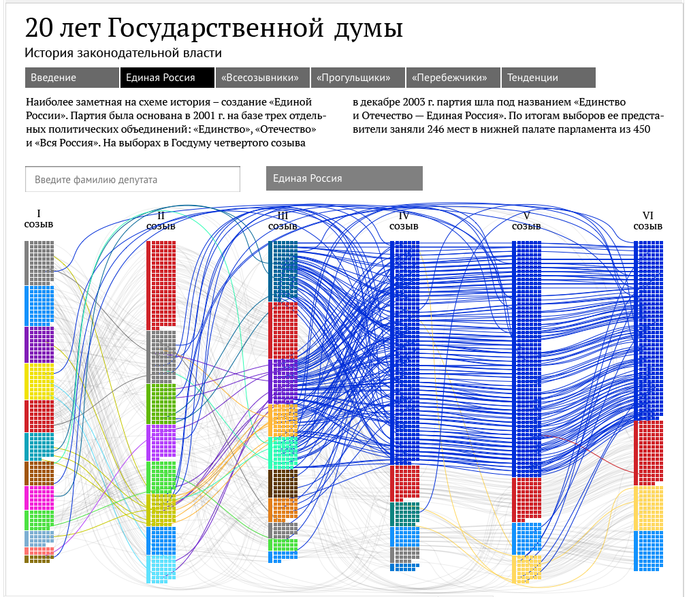

Title: Political projects I worked on at Ria Novosti (2013-2015).
Date: 2020-05-02 00:20
save_as: projects/ria_novosti_projects.html

## Where did they go? How Russian Deputies changed their political alignment

Project dedicated to 20th anniversary of Russian Duma (Parliament), tracing back the political alignment of deputies and all Political Parties ever present in there.

##### Team: 

code: **Michail Dunayev**
design: **Valeriy Borisov** 
editor, analyst: **Philipp Kats**
director: **Maya Stravinskaya**

## Clustering Russian Deputies

**Clustering Russian Deputies** is a project done in 2013 at *Ria Novosti Studio of Infographics*. Project explores how actual votes of Russian deputies are revealing underlying political structures and fractions, and how that behavior changes based on the topics of the laws. It also highlights how specific deputies voted on key issues, such as Prohibition of international adoption of Russian children, and some others.

Unfortunately, project itself is removed from the site now, but here is a review (and archived screenshot)
- [description](https://ria.ru/20130708/948263330.html)

##### Team:

code: **Evgeny Panov**
design: **Alexey Novichkov, Valeriy Borisov**
editor, analyst: **Philipp Kats**
director: **Maya Stravinskaya**

## Deputies Tax Declarations "Calculator"

A visual representation of Deputies' tax declaration and distribution - who owns what and how much of it.
Data was collected, parsed and cleaned. Car prices were estimated using external databases

## Russian Government Budget "Calculator"

Visual representation of the state budget, and a "minigame" / survey on your personal preferences. For each custom budget, a country with similar budget strategy is shown.

## Pension Reform Calculator (How they got you)

A visual representation of a new "Formula" for official pension (social security payments). Shows how it results in the same amount "on paper", allowing government to pay less over time.

